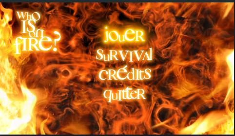
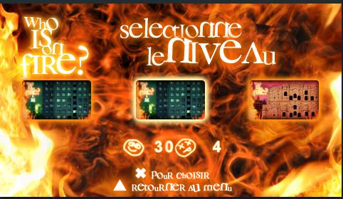
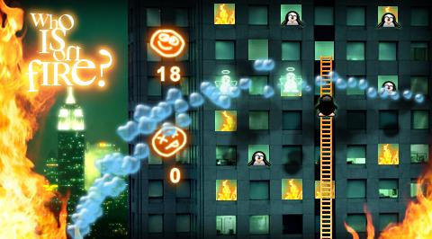
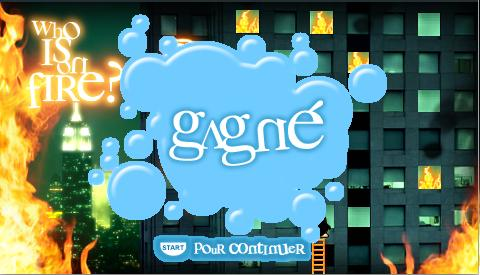
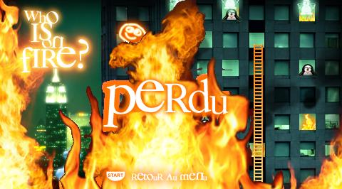
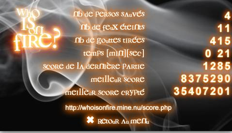
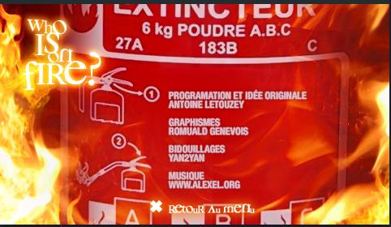

# WIOF: Who is on Fire?

## What is this?
A 2D game for the Sony Playstation Portable created in 2007.

You play as a firefighter trying to save a bunch of animals from various burning places. The game features a dozen of 
levels and an infinite survival mode. It used to have an online leaderboard.

## Screenshots

- Menu Screen

- Level selection

- Gameplay

- Win and Lose screens

- Survival mode scores

- Credis

## Credits

All the code written by me. 

All 2D assests created by [Romuald Genevois](https://www.romualdgenevois.com/).

All audio assets created by [Alexel](https://alexel.org/)